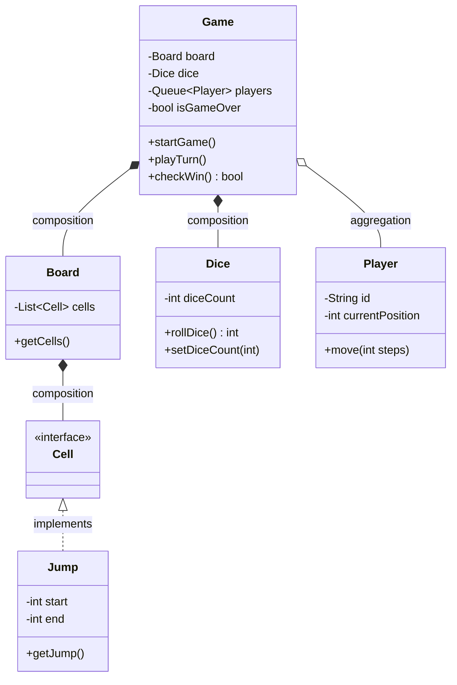

# Snake and Ladder Game  
**Complete UML Diagram, Objects, Requirements, and Design Pattern Mapping**

---

## 1. UML Class Diagram

---

## 2. Major Objects

- **Dice**
  - Handles dice rolling logic.
  - Property: `diceCount` (scalable number of dice).
  - Method: `rollDice()`, `setDiceCount(int)`.

- **Board**
  - Contains the array/list of cells.
  - Method: `getCells()`.

- **Cell (interface)**
  - Represents any cell on the board.
  - Implemented by `Jump`.

- **Jump (Snake/Ladder)**
  - Cell subclass: represents snakes and ladders.
  - Properties: `start`, `end`.
  - Method: `getJump()`.

- **Player**
  - Has ID and `currentPosition`.
  - Method: `move(int steps)`.

- **Game**
  - Holds board, dice, player queue.
  - Has `isGameOver`, controls game flow.
  - Methods: `startGame()`, `playTurn()`, `checkWin()`.

---

## 3. Requirement Classifications + Implementation Mapping

| Requirement                  | Implementation                                                                                                  |
|------------------------------|-----------------------------------------------------------------------------------------------------------------|
| **How many dice?**           | Dice class with `diceCount` and `setDiceCount`. Can scale from 1 to many dice.                                  |
| **How many snakes/ladders?** | `Jump` objects (Snake/Ladder) added to Board's cell list dynamically at runtime.                                |
| **Winning condition?**       | Game class tracks `isGameOver`; uses `checkWin()` to determine if a player has won after each move/turn.        |

---

## 4. Design Patterns Used

| Pattern      | Where/Why                                                                                               |
|--------------|--------------------------------------------------------------------------------------------------------|
| Factory      | For creation of Cell/Jump objects when configuring the board.                                           |
| Strategy     | Dice rolling algorithm; possibly for player movement logic (if multiple algorithms supported).          |
| Observer     | To notify when game state changes (game end or player actions); useful for UI/logging integration.      |
| Singleton    | (Optional) If only a single global Game manager is desired.                                             |
| State        | (Optional, advanced) For different game phases (`InitState`, `PlayingState`, `FinishedState`).          |
| Command      | (Optional) Each Player turn as a command (for undo/redo, move history purposes).                        |

#### **Pattern Mapping in Classes/Flow:**

- **Factory**  
  Used when board configuration is created, determining whether each cell is plain or a Jump (snake/ladder).

- **Strategy**  
  Dice's rolling logic can be changed dynamically.  
  Example: If you want to swap fair dice for loaded dice, plug-in a different strategy.

- **Observer**  
  Game can notify listeners when a player's position changes or when someone wins.

- **Singleton**  
  If the app allows only one running Game instance.

- **State**  
  To keep transition logic clean between game phases.

- **Command**  
  Represents each player's move as a command for easy undo/redo.

---

## 5. Game Workflow Example

1. **Initialize Game:**  
   - Configure board with cells and Jumps (snakes/ladders) using Factory.  
   - Configure dice (scalable via `diceCount`).  
   - Add players.

2. **Gameplay Loop:**  
   - Players take turns (managed by Game queue).
   - On turn: roll dice (using selected Strategy), move Player.
   - If Player lands on Jump: move accordingly.
   - After each move: checkWin() updates isGameOver.

3. **Dynamic Features:**  
   - At any time, number of dice or snakes/ladders can be changed, board reconfigured.

4. **Game End:**  
   - Game ends when a player reaches the final cell.

---

## 6. How Objects & Requirements Are Mapped

- **Dice:** Has `diceCount` property; use `setDiceCount()` for scalability.
- **Snake/Ladder:** Jumps are dynamically created and added to Board (`Jump` implements `Cell`).
- **Board:** Holds all cells, including those containing snakes/ladders.
- **Players:** Managed in a turn queue by Game.
- **Cell:** Base type; Jump=snake/ladder is a special Cell.
- **Requirements:** Handled via class structure and mapped design patterns.
- **Winning Condition:** Tracked by `isGameOver` in Game and checked after every move.

---

## 7. Visualization

---

**This document covers:**
- UML class diagram with relationships.
- Object list.
- Requirement mapping.
- Design patterns applied to your architecture.
- Example workflow.
